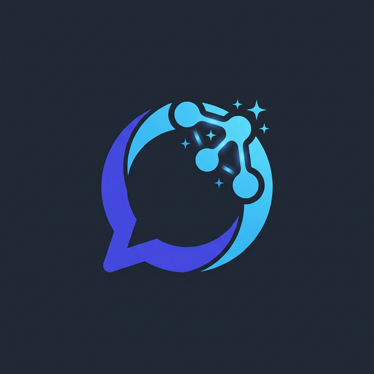

# SupportAI - Customer Support Chatbot Platform



**SupportAI** is a modern, production-ready SaaS platform that allows businesses to create, train, and embed custom AI customer support chatbots directly onto their websites. Built with Next.js 14, Tailwind CSS, Supabase, and OpenAI, this platform provides everything a business needs to automate customer service using their own data.

## 🚀 Key Features

*   **Custom Knowledge Base:** Train your AI chatbot by uploading PDFs, pasting website URLs, or adding manual FAQ entries.
*   **Embeddable Widget:** Generates a lightweight, customizable JavaScript snippet that can be injected into any website to render the floating chat widget.
*   **Real-time Conversations:** View and manage live chatbot conversations directly from the dashboard.
*   **Lead Capture Automation:** The chatbot intelligently asks for user details (name, email) when it cannot resolve an issue, storing actionable leads.
*   **Analytics Dashboard:** Track AI response rates, conversation volume over time, and identify common customer pain points.
*   **Beautiful UI:** A dark-themed, glassmorphic SaaS interface built completely with Tailwind CSS, ensuring smooth animations and a premium feel.

## 🛠️ Tech Stack

*   **Frontend Framework:** Next.js 14 (App Router)
*   **Styling & UI:** Tailwind CSS, Lucide React (Icons)
*   **Charts & Visualizations:** Recharts
*   **Backend API:** Next.js Route Handlers (`/api/*`)
*   **Database & Auth:** Supabase (PostgreSQL & Row-Level Security)
*   **AI Integration:** OpenAI GPT (`gpt-3.5-turbo`)

## 🏗️ Architecture Overview

The system is split into three main components:

1.  **The Admin Dashboard:** A protected Next.js area (`/dashboard`) where business owners log in using Supabase Auth to manage their chatbot settings, upload training data, and view captured leads.
2.  **The API Layer:** Serverless Next.js API routes that handle vectorizing training data and securely proxying requests to the OpenAI API, keeping API keys safe from the public.
3.  **The Chat Widget (`npm run dev` serves `public/widget.js` & `/api/widget/[id]`):** An iframe-based injectable component that connects a website visitor seamlessly to the SupportAI backend. 

## ⚙️ Local Development Setup

To run this project locally:

1.  Clone the repository and install dependencies:
    ```bash
    npm install
    ```
2.  Set up your environment variables in `.env.local`:
    ```env
    NEXT_PUBLIC_SUPABASE_URL=your_supabase_url
    NEXT_PUBLIC_SUPABASE_ANON_KEY=your_supabase_anon_key
    OPENAI_API_KEY=your_openai_api_key
    ```
3.  Run the database migrations to set up your Supabase tables. The schema is located at `supabase/schema.sql`.
4.  Launch the development server:
    ```bash
    npm run dev
    ```
5.  Open [http://localhost:3000](http://localhost:3000) to view the landing page.

## 📸 Screenshots

Checkout the `/screenshots` directory in the repository to view desktop and mobile screenshots of the entire platform flow!

---
*Developed as a fully-featured SaaS portfolio project.*
